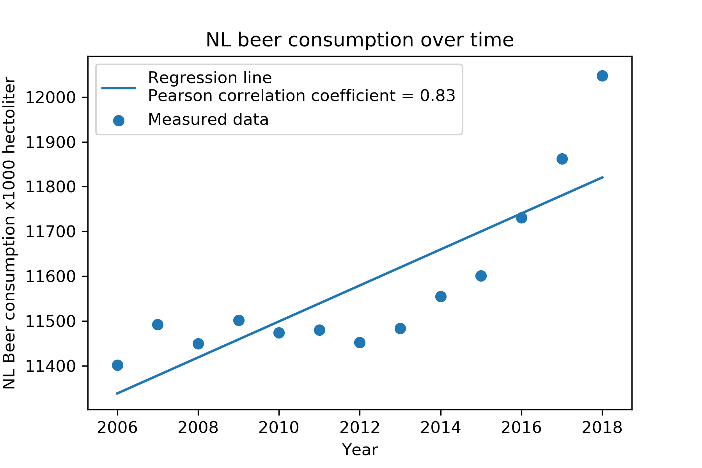

# CS Assignment

1. The titles of the following papers pivotal to our knowledge:
  - MCC Van Dyke et al., 2019
    - Van Dyke, M. C. C., Teixeira, M. M., & Barker, B. M. (2019). Fantastic yeasts and where to find them: the hidden diversity of dimorphic fungal pathogens. Current opinion in microbiology, 52, 55-63.
    - Van Dyke, M. C. C., Thompson, G. R., Galgiani, J. N., & Barker, B. M. (2019). The Rise of Coccidioides: Forces Against the Dust Devil Unleashed. Frontiers in immunology, 10, 2188.
  - JT Harvey, Applied Ergonomics, 2002
    - Harvey, J. T., Culvenor, J., Payne, W., Cowley, S., Lawrance, M., Stuart, D., & Williams, R. (2002). An analysis of the forces required to drag sheep over various surfaces. Applied ergonomics, 33(6), 523-531.
  - DW Ziegler et al., 2005
    - Ziegler, D. W., Lois, M., Hess, D., Pinilla, J., & Tellez, G. (2005). Correlation of continuous cardiac output measured by a pulmonary artery catheter versus impedance cardiography in ventilated patients. Chest, 128(4), 194S.
2. Create 1 plot from the dataset "istherecorrelation.csv", with DPI=300. The objective is to visualize the data as you see fit. Include the resulting image in the markdown file (and you can also write a few lines of interpretation if you like).
  - 